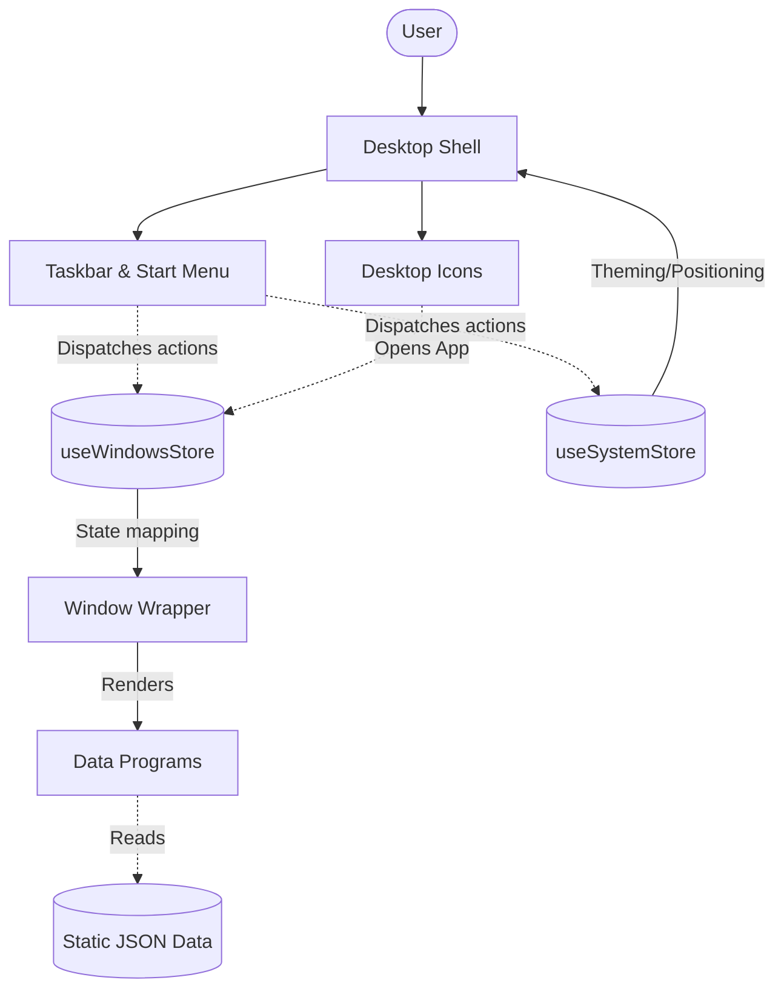

# Architecture

The system is designed as a client-side Single Page Application (SPA) that emulates a desktop operating system. It relies heavily on global state management to synchronize the complex interactions between the desktop canvas, the active windows, and the taskbar. 

Data flows unidirectionally from the static JSON files into the Pinia stores, which then dictate what the Vue components should render. The UI is composed of a rigid outer shell (the Desktop and Taskbar) and dynamic inner nodes (the Windows).

## Components

- **Desktop Shell (`Desktop.vue`)** — The root visual container. It is responsible for rendering the background, the desktop icons, and iterating over the active windows in the `windowsStore` to spawn `WindowWrapper` instances.
- **Window Manager (`useWindowsStore`)** — The brain of the OS. It tracks coordinates (x, y, width, height), z-indexes, minimization states, and edge-snapping for every active window. 
- **WindowWrapper (`WindowWrapper.vue`)** — The physical manifestation of a window. It intercepts mouse/touch events to handle dragging and resizing (via VueUse), and delegates content rendering to dynamic slots.
- **Taskbar & Start Menu** — The global navigation hub. It communicates with the `systemStore` to position itself (top, bottom, left, right) and communicates with the `windowsStore` to minimize/restore active applications.
- **Data Programs** — Specific Vue components (`AboutMe.vue`, `ProjectViewer.vue`) that consume local JSON data and render the actual portfolio content inside a `WindowWrapper`.

## System Diagram

## Data Flow

1. **User interaction** — A user single-clicks a `DesktopIcon` or a Start Menu item.
2. **State mutation** — The component calls `windowsStore.registerOrOpenWindow(appId)`.
3. **Window spawning** — The store updates its reactive array of active windows. `Desktop.vue` detects this reactivity and dynamically mounts a new `WindowWrapper` for that `appId`.
4. **Content rendering** — The `WindowWrapper` dynamically imports and mounts the corresponding Program component (e.g., `ProjectViewer.vue`).
5. **Data ingestion** — The Program component imports the static JSON file (`projects.json`), localizes the data via `vue-i18n`, and renders the HTML.

## Key Design Decisions

- **Web-Native Compromise:** As documented in ADR-001, the system forces windows to maximize on mobile viewports (<768px) and utilizes single-click (rather than OS double-click) to ensure the portfolio remains highly usable on the modern web.
- **Iframe Recursion Bypass:** To allow the portfolio to showcase itself as a project (an OS within an OS), the `IframeViewer` component dynamically injects randomized query parameters to bypass browser infinite loop protections.
- **Split Typography:** The OS shell utilizes system `font-sans` for maximum legibility at small sizes, while the inner window content utilizes `Cabinet Grotesk` to maintain a premium agency aesthetic.