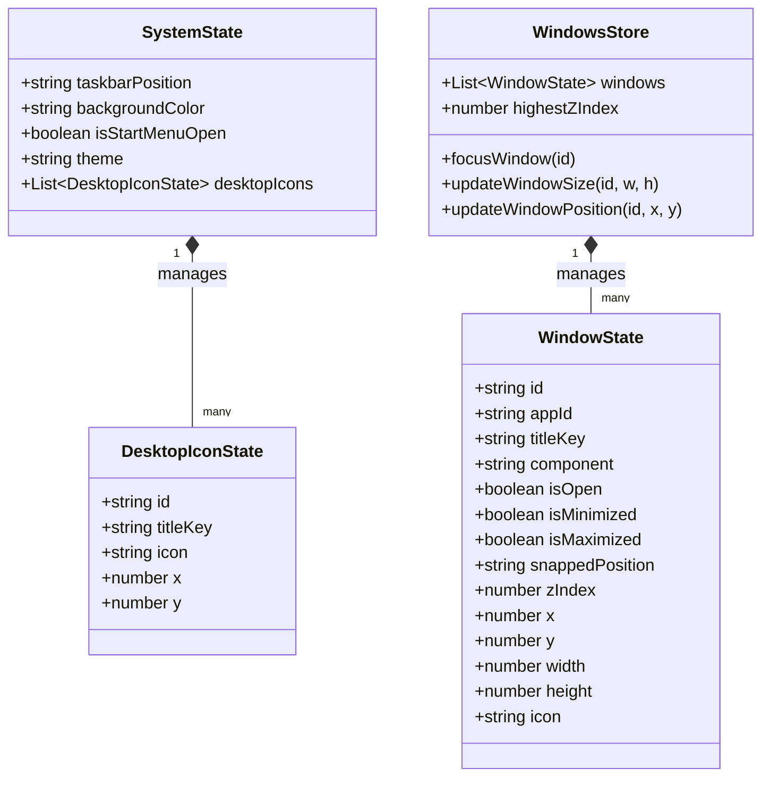

# Class Diagram

## Core State Models

## Notes

Because Vue 3 Composition API stores do not strictly utilize ES6 classes, the diagram above models the shape of the TypeScript interfaces and the functional mutations occurring within the Pinia stores. The `WindowState` is the single source of truth that the `WindowWrapper.vue` component watches reactively to update its inline CSS.