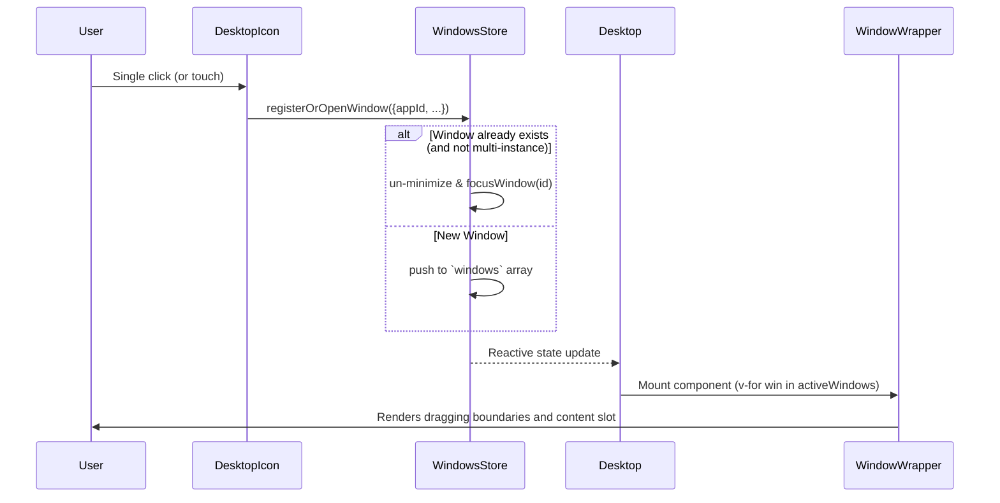
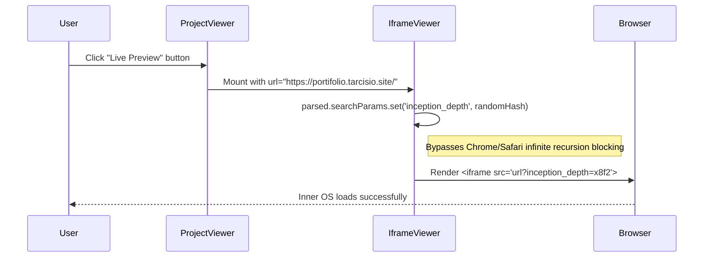

# Sequence Diagrams

## Workflow: Spawning a New Window

This workflow occurs when a user single-clicks a Desktop Icon or selects an app from the Start Menu.

## Workflow: Infinite Iframe Inception

This workflow occurs when a user opens the "Portfólio OS" project inside the `ProjectViewer` to see a live preview of the OS within the OS.

